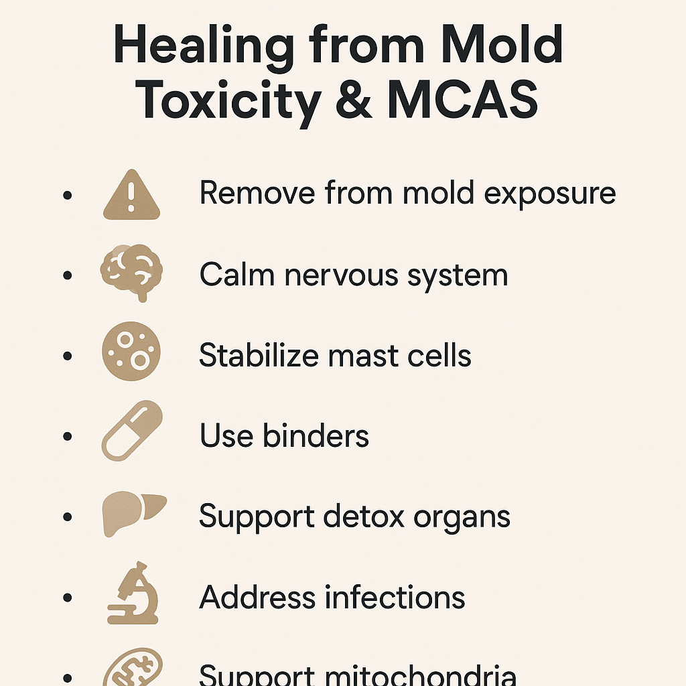

Toxic: Heal Your Body from Mold Toxicity, Lyme Disease, Multiple Chemical Sensitivities, and Chronic Environmental Illness

https://www.amazon.com.au/Toxic-Neil-Nathan-ebook/dp/B09PLLQYS9/?_encoding=UTF8&pd_rd_w=2isS7&content-id=amzn1.sym.4698c8dd-eb22-4b89-b049-5ce4d5b991a3&pf_rd_p=4698c8dd-eb22-4b89-b049-5ce4d5b991a3&pf_rd_r=355-9374064-0586420&pd_rd_wg=6JMIX&pd_rd_r=f6e773b0-fbdb-456d-ba22-a84480ec17f3&ref_=aufs_ap_sc_dsk

Here’s a concise summary of the **key takeaways** from *"Toxic"* by Dr. Neil Nathan, based on deeper reviews, practitioner breakdowns, and citations:

### 🧠 Core Principles from *Toxic*:

- **Mold toxicity and MCAS often go unrecognized** and are *root causes* of many chronic illnesses (especially those with fatigue, brain fog, insomnia, and sensitivities).
  
- **You must calm the limbic system and vagus nerve first** (i.e., downregulate fight-or-flight), or nothing else will work well — healing is blocked in a stressed nervous system.

- **Mast Cell Activation Syndrome (MCAS)** is common in mold/Lyme patients and leads to exaggerated allergic-type responses; stabilizing mast cells is critical early in treatment.

- **Toxins must be removed in the correct order**:
  - First: **Calm nervous system**
  - Second: **Stabilize mast cells / histamine intolerance**
  - Then: **Bind mold toxins** (cholestyramine, bentonite, charcoal, etc.)
  - Only after: **Treat infections like Lyme, co-infections, parasites**

- **Treating too aggressively or too soon (like antimicrobials or killing infections)** before detox or calming can crash sensitive patients.

- **Binders must be matched to the mycotoxins present**, not used randomly.

- **Environmental control (getting out of mold exposure)** is *non-negotiable* — no healing is possible if you're still exposed.

- **Supporting mitochondria, methylation, and detox pathways** (e.g. glutathione, B vitamins, minerals) helps reduce reactivity and build resilience.

- **Healing is very individualized and slow** — pacing is key, especially for hypersensitive patients.

---

### 💊 Practical Summary of Steps:

1. **Remove yourself from mold exposure** (even small, hidden exposures count).
2. **Calm the nervous system** (DNRS, Gupta Program, vagus nerve stimulation, limbic retraining).
3. **Stabilize mast cells** (H1/H2 blockers, quercetin, cromolyn sodium, DAO, low-histamine diet).
4. **Use binders** appropriately (cholestyramine, charcoal, bentonite, etc.) based on toxin testing.
5. **Support detox organs**: liver, lymph, kidneys (sauna, sweating, hydration, glutathione).
6. **Address infections later** (Lyme, EBV, parasites) once system can tolerate treatment.
7. **Support mitochondrial function and cellular energy** (CoQ10, B12, magnesium, NAD+).

---

### Verdict:

Not "mambo-jumbo" — the approach is well-aligned with many functional and environmental medicine practitioners. It’s especially helpful for **sensitive, chronically ill patients** who’ve failed conventional Lyme/mold protocols. However, it’s **not a quick-fix book**; it’s methodical and tailored to those with complex illness.
